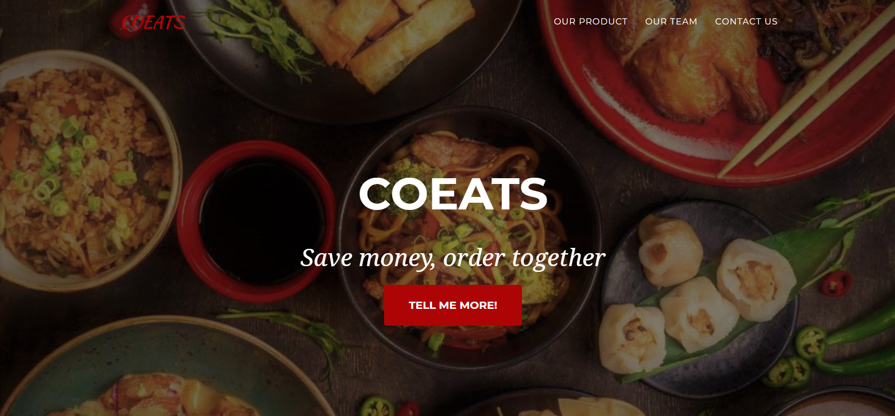
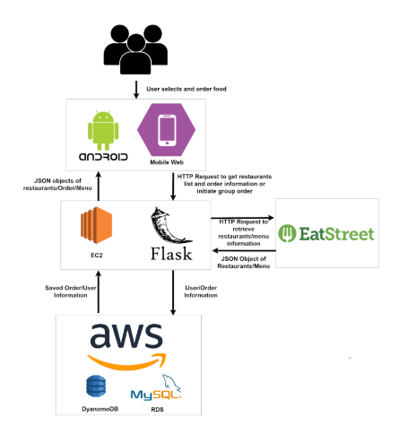
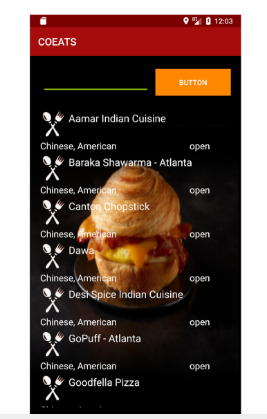
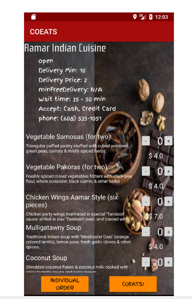
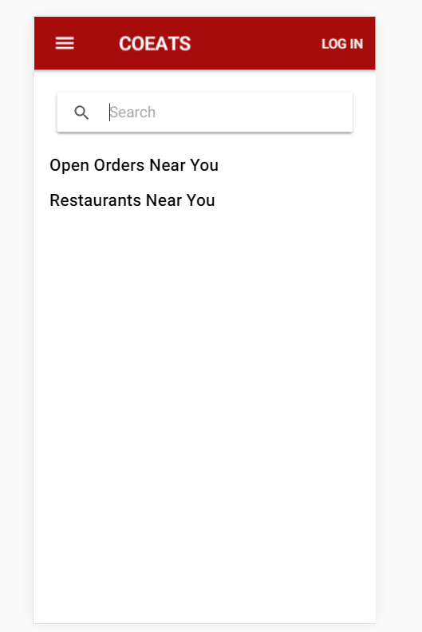
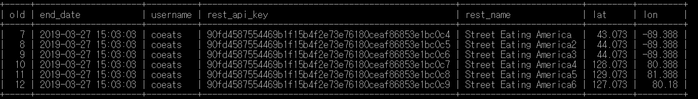

# COEATS

[Deliever API Link](https://developers.eatstreet.com/) 
## Website
ec2-18-188-100-25.us-east-2.compute.amazonaws.com:5000

## Aritecture

## Android Layout

## Mobile Web Layout

# JSON format
No accurate JSON format by now, below are the necessary information. 
# API Calls
**/API/get_list_of_categories [GET]** 
{"result": "OK", "categories":["Asian", "Mexican", "European", "American"]})
**/API/verifyUser [POST]** \
need Json Format of \
{ "userId": userid, \
"password": password}\
**/API/get_restaurants [POST]** \
needs to pass {"query": ?, "loc": //address} or {"query":?, "lat": //latitude, "lon": //longitude}
returns\
{"result": "OK", "restaurants": [{"name": "Aamar Indian Cuisine", "rest_api_key": "d28dd32538ddfd3af15b4f2e73e761805f2f9e661202a1ab", "logo": "https://eatstreet-static.s3.amazonaws.com/assets/images/restaurant_logos/aamar-indian-cuisine-31337_1435789176632.png", "min_wait_time": 45, "max_wait_time": 60, "delivery_price": 0.0}, {"name": "Baraka Shawarma - Atlanta", "rest_api_key": "d28dd32538ddfd3afe2bbabe6b94d9a62c4582e81e910454", "logo": "https://eatstreet-static.s3.amazonaws.com/assets/images/restaurant_logos/baraka-shawarma-8963_1394043335551.png", "min_wait_time": 45, "max_wait_time": 60, "delivery_price": 5.0}, {"name": "Nancy's Pizza", "rest_api_key": "d28dd32538ddfd3a144247b91fbcb2f3bb77b07695b3c9d0", "logo": "https://eatstreet-static.s3.amazonaws.com/assets/images/restaurant_logos/nancys-pizza-28935_1426106661967.png", "min_wait_time": 45, "max_wait_time": 60, "delivery_price": 3.0}, {"name": "Niramish Indian Cuisine", "rest_api_key": "d28dd32538ddfd3a884225aec137a02aa7d9b968abbb3711", "logo": "https://eatstreet-static.s3.amazonaws.com/assets/images/restaurant_logos/niramish-indian-11761_1399503390661.png", "min_wait_time": 45, "max_wait_time": 60, "delivery_price": 4.0}, {"name": "Panahar Bangladeshi Cuisine", "rest_api_key": "d28dd32538ddfd3af15b4f2e73e761806ec7f4bbd466955e", "logo": "https://eatstreet-static.s3.amazonaws.com/assets/images/restaurant_logos/panahar-bangladeshi-cuisine-35875_1458160956791.png", "min_wait_time": 45, "max_wait_time": 60, "delivery_price": 8.0}]}\
**/API/get_menus [POST]**\
pass {"rest_api_key": sth}\
returns\
{"result": "OK", "menus": [{"name": "Vegetable Samosas (for two)", "menu_api_key": "9895624", "price": 4.0}, {"name": "Vegetable Pakoras (for two)", "menu_api_key": "9895625", "price": 4.0, "description": sth}]}\
/API/fakejoin\
{"restaurants": [{"num_joined": 2, "Name": "ChickFila", "remaining_time": 60, "type": ["American", "Asian"]}, {"num_joined": 1, "Name": "Panda Express", "remaining_time": 120, "type": ["Chinese", "Japanese"]}], "result": "OK"}\

**/API/init_join [POST]**\
pass\
{\
       “duration”: 10, // minutes how long user will wait\
       “rest_api_key”: “12312A123F9F9”, //restaurant key\
      “rest_name”: “Hello man”, // restaurant name\
      “lat”: 127.12, //latitude and longitude\
     “lon”: 89.21\
     "username": "coeats", // current user Id\
     "min_people: 4, // minimum people user set to be executed
     "min_amount: 10.5, // $amount user sets for order to be executed
     "item_api_key": "12sfas312A123F9F9", // item api  
}\
returns {"result": "OK"}\
**/API/join [POST]**\
pass\
{\
       "oId": 13, // Order Id you got from get_join_list\
       "username": "coeats",\
       "item_api_key": "afasdf12312dfsafasdf", // item api key\
       "item_price": 14.21\
}\
return {"result": "OK"}\
**/API/get_join_list [POST]**\
pass\
{\
       “distance”: 10, // km how far user can go\
      “lat”: 127.12, //latitude and longitude\
     “lon”: 89.21\
}\
return\
{"result": "OK", "orderList": [{"rest_api_key": "dasfasfs9sadf", "rest_name": "coeats", "lat": 127.21, "lon": 87.12]}\
lat and lon are latitude and longitude of user (who first started the group order)'s location.\

**/API/get_order_status [POST]**\
pass\
{"oId": 13}\
return\
either\
{"result": "OK", "status": "IP", "oId": oId, "total_amount": total_amount,
                    "num_people_joined": num_people, "time_remaining": min_rem} or\
{"result": "OK", "status": "F", "Executed": "True"}\
{"result": "OK", "status": "F", "Executed": "False"}\
                    
# Order Process
if you want to create your own order -> *init_join*\
People can grab current order list by *get_join_list*\
You can call *get_menus* with given restaurant api_key\
User selects and order\
You can call *join* with needed parameters\
You can constantly checks order by *get_order_status*

# Discussion
* Could you add some fake items to the get_join_list?
* I will do that later today like 7 or 8 and update it in README.

  
* get_join_list returns HTTP_INTERNAL_ERROR, and get_restaurant seems not working too. Anything to do with location calculation?\
Internal has to do with server, so I don't think it is due to location. I think some people use random bot to hack into system and that might be cause of INTERNAL_SERVER_ERROR. I restarted it. Let me know through messenger if this happens. I will just restart the server.
  
* Set 3 standards for coeats order. First, people reaches x (default 1). Second, time limits x min (default 2). Third, Money reaches $ x (default 0).
Need more explanation. Do users set these standards?\
Yes\

* This can be used for our payment. let me know if you guys find other API.\
**https://developers.braintreepayments.com/guides/client-sdk/setup/android/v2
